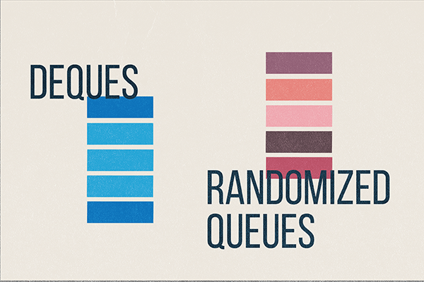

### Deques and Randomized Queues

**Algorithms Part 1 | Coursera course | Week 2
Assignment | [my coursera profile](https://www.coursera.org/user/045cf702be8b31ef1aa039e2b4f07db6)**

---
<!-- TOC -->

* [Deques and Randomized Queues](#deques-and-randomized-queues)
* [Task specification](#task-specification)
    * [Deque API](#deque-api)
    * [Randomized Queue API](#randomized-queue-api)
* [Useful resources that have helped me in completing this assignment:](#useful-resources-that-have-helped-me-in-completing-this-assignment)

<!-- TOC -->

---

### Task specification

🔗Detailed specifications for the assignment can be
found [here](https://coursera.cs.princeton.edu/algs4/assignments/queues/specification.php).

The task is to write a generic data type for a deque and a randomized queue.

**Dequeue** is a double-ended queue or deque (pronounced “deck”) is a generalization of a stack and a queue that
supports adding and removing items from either the front or the back of the data structure.

**Randomized queue** is similar to stack or queue, except that the item removed is chosen uniformly at random among
items in the data structure.

---

#### Deque API

```
public class Deque<Item> implements Iterable<Item> {
    public Deque()                          // construct an empty deque
    public boolean isEmpty()                // is the deque empty?
    public int size()                       // return the number of items on the deque
    public void addFirst(Item item)         // add the item to the front
    public void addLast(Item item)          // add the item to the back
    public Item removeFirst()               // remove and return the item from the front
    public Item removeLast()                // remove and return the item from the back
    public Iterator<Item> iterator()        // return an iterator over items in order from front to back
    public static void main(String[] args)  // unit testing (required)
}

``` 

---

#### Randomized Queue API

```
public class RandomizedQueue<Item> implements Iterable<Item> {
    public RandomizedQueue()                // construct an empty randomized queue
    public boolean isEmpty()                // is the randomized queue empty?
    public int size()                       // return the number of items on the randomized queue
    public void enqueue(Item item)          // add the item
    public Item dequeue()                   // remove and return a random item
    public Item sample()                    // return a random item (but do not remove it)
    public Iterator<Item> iterator()        // return an independent iterator over items in random order
    public static void main(String[] args)  // unit testing (required)
}
```

---

### Useful resources that have helped me in completing this assignment:

🔗[Prinstion's video explonation of the assignment](https://www.youtube.com/watch?v=GNr872PjQMI)

---